 

## About

Computer Engineering undergraduate at **Shahid Beheshti University**, focused on the intersection of **backend engineering, AI infrastructure, and Linux systems**.

I am interested in building reliable software, understanding systems beyond the application layer, and working with technologies related to APIs, databases, LLM serving, networking, containers, and embedded Linux.

## Engineering Focus

| ⚙️ Backend Engineering | 🧠 AI Infrastructure | 🐧 Linux & Systems |
|:---:|:---:|:---:|
| REST APIs | LLM Serving | Linux Administration |
| Django REST Framework | RAG Systems | Docker & Bash |
| PostgreSQL | vLLM & LlamaIndex | OpenBMC |
| Authentication | Embeddings | TCP/IP & TLS |
| Software Architecture | Inference Monitoring | System Performance |

 

## Languages & Tools

## Contribution Activity

<picture>
  <source
    media="(prefers-color-scheme: dark)"
    srcset="https://raw.githubusercontent.com/eagertowork/eagertowork/output/github-contribution-grid-snake-dark.svg"
  />
  <source
    media="(prefers-color-scheme: light)"
    srcset="https://raw.githubusercontent.com/eagertowork/eagertowork/output/github-contribution-grid-snake.svg"
  />
  
</picture>
